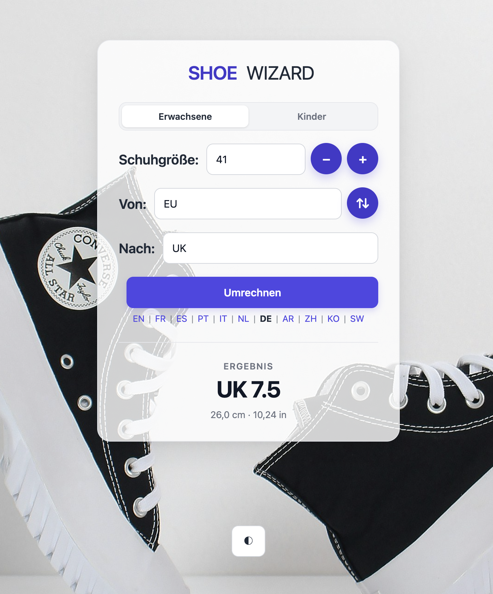

# Bakame Shoe Sizes Converter

This small application was prompted by the following post
https://phpc.social/@nando161@partyon.xyz/117123893682362282

Converting shoes size is difficult, too difficult!!


I discovered [schuhgroessen-umrechner](https://github.com/sarah-schuh/schuhgroessen-umrechner)
and, inspired by Sarah's excellent work, built this small library as an
independent reimplementation.

## System Requirements

- **PHP >= 8.4** is required but the latest stable version of PHP is recommended.

> [!IMPORTANT]
> If the conversion data is stored in a CSV file you will have to install **`league/csv` >= 9.28**
>
> If the conversion data is stored in a database, **`ext-pdo`** support is required.

## Installation

**Shoe size converter** is available on [Packagist](https://packagist.org/packages/bakame/shoes-size-converter) and can be installed using [Composer](https://getcomposer.org/):

~~~
composer require bakame/shoe-size-converter
~~~

## The SPA

The original script by Sarah Amft has been reimplemented using this library's API
and is available in the `public` directory. It provides a small single-page application
for converting adult and children's shoe sizes between supported shoe size systems.

To run the converter locally:

- Install this repo via **git clone**,
- Run `composer install`
- Change to the `public` directory inside the root directory,
- Start PHP's built-in development server:

```bash
php -S localhost:4000
````

Then open http://localhost:4000/ in your browser.

The application allows you to convert both adult and children's shoe sizes.




## The CLI command

The package also provides a command-line converter.

To run the CLI command locally:

- Install this repo via composer

```bash
vendor/bin/shoe-converter EU 42.5
```

This returns:

```bash
Shoe size conversion
Input
  eu 42.5 (adults)
Sizes (calculated)
  mondopoint 270
  cm 27
  eu 42.5
  uk 9
  us_men 10
  us_women 11
Measurements
  27 cm
  10.629921259843 in
```

The first argument is the input shoe size unit, followed by the shoe size value. For example:

```bash
vendor/bin/shoe-converter EU 42.5
vendor/bin/shoe-converter UK 9
vendor/bin/shoe-converter US_MEN 10
```

You can specify the shoe size system using the `--type` or `-t` option. The
supported values are `adults` and `children`. The `adults` system is used by
default when no type is explicitly specified.

```bash
vendor/bin/shoe-converter EU 7.5 --type children
vendor/bin/shoe-converter UK 9 -t children
vendor/bin/shoe-converter US_MEN 10 --type adults
```

| Option         | Description                              | Default  |
| -------------- | ---------------------------------------- | -------- |
| `--type`, `-t` | Shoe size system: `adults` or `children` | `adults` |


## The Library

Create a shoe size using one of the supported units:

```php
use Bakame\Shoes\AdultUnit;
use Bakame\Shoes\ChildUnit;

$euShoeSize = AdultUnit::Eu->size(43);
// $euShoeSize is an instance of Bakame\Shoes\AdultSize
$ukChildSize = ChildUnit::Uk->size(7.5);
// $ukChildSize is an instance of Bakame\Shoes\ChildSize
```

Both instances expose their numeric value and unit:

```php
$euShoeSize->value;
// 43

$euShoeSize->unit;
// Unit::Eu

$euShoeSize->human();
// EU 43
```

> [!IMPORTANT]
> Adult and children's shoe sizes differ in how their conversions are determined.
> Adult shoe sizes can be converted using deterministic foot-length-based formulas,
> whereas children's shoe sizes **MUST** use a specific conversion table.

### Adult shoe size conversions

#### Calculated conversions

`AdultSize` supports deterministic shoe-size calculations based on foot length.
You can calculate an equivalent shoe size in any supported adult unit using
`AdultSize::in()`:

```php
$ukShoeSize = $euShoeSize->in(Unit::Uk);
// returns an AdultSize containing the calculated UK size

$ukShoeSize->value;
// 9.5

$ukShoeSize->unit;
// Unit::Uk
```

The calculated value is the nearest size supported by the target sizing system.
It is **not a lookup in the ISO conversion table**.

You can also calculate all supported adult equivalents at once with
`AdultSize::equivalents()`:

```php
$result = $euShoeSize->equivalents();
// returns an array containing the calculated equivalent shoe sizes
// for all supported adult units
```

These calculation methods are only available for `AdultSize`. Children's shoe
sizes cannot be calculated using foot-length-based formulas and therefore must
be converted using the conversion table.

#### Physical measurements

An `AdultSize` can also be represented as a physical foot measurement.
Dedicated methods are available for millimeters, centimeters, and inches:

```php
use Bakame\Shoes\LengthUnit;

$ukShoeSize->footLength(LengthUnit::Millimeter);
// 275

$ukShoeSize->footLength(LengthUnit::Centimeter);
// 27.5

$ukShoeSize->footLength(LengthUnit::Inch);
// 10.826771653543
```

These measurements are calculated from the shoe size's foot length and are
independent of the conversion lookup table.

For children's shoe sizes, where a foot-length calculation cannot be used,
`Converter::footLength()` retrieves the corresponding measurement from the
conversion table:

```php
$length = $converter->footLength($ukChildSize, LengthUnit::Centimeter);
// returns the length found in the conversion table
```

`Converter` can also be used for adult shoe sizes. When an adult size or
measurement is not available in the conversion table, `Converter` falls back
to the corresponding calculation.

This means that `Converter::size()` and `Converter::footLength()` can be used
with both adult and children's shoe sizes while preserving the appropriate
conversion strategy for each system.

### ISO 19407:2023-based conversions

If you want to use the provided conversion data, use `Converter`.

`Converter::size()` and `Converter::equivalents()` use the configured conversion
table and fall back to the calculation algorithm when converting an `AdultSize`
if the required data is not available. For `ChildSize`, the conversion table is
the only source of conversion data.

These methods can be used for both adult and children's shoe sizes, provided
that the `Converter` is configured with the corresponding `ShoeType`.

For example:

```php
$ukShoeSize = $converter->size($euShoeSize, Unit::Uk);
// returns the UK equivalent found in the conversion table
```

Or retrieve all available equivalents:

```php
$result = $converter->equivalents($euShoeSize);
// returns the equivalent shoe sizes found in the conversion table
```

If no equivalent is present in the conversion table, `Converter` falls back to
the calculation algorithm for `AdultSize`. For `ChildSize`, no equivalent can
be calculated, so `null` is returned when no matching entry is found.

|                            | Adult                   | Children      |
|----------------------------|-------------------------|---------------|
| `AdultSize::in()`          | Calculation             | Not available |
| `AdultSize::equivalents()` | Calculation             | Not available |
| `AdultSize::footLength()`  | Calculation             | Not available |
| `Converter::size()`        | Table, then calculation | Table only    |
| `Converter::equivalents()` | Table, then calculation | Table only    |
| `Converter::footLength()`  | Table, then calculation | Table only    |

## Persistence Layer

The converter can be created using one of the following data sources:

* a CSV file path or file stream;
* a PDO connection; or
* no data source, in which case the default conversion table is used.

When a file path or stream is provided, it must reference a valid CSV file with
the expected structure for the selected `ShoeType`. When a PDO connection is
provided, the database must contain the appropriate conversion table with the
expected columns for the selected `ShoeType`.

The expected structure depends on the shoe size system:

- **Adults** — `eu`, `us_men`, `us_women`, `uk`, `cm`, and `mondopoint`.
- **Children** — `eu`, `us`, `uk`, `cm`, and `mondopoint`.

For CSV sources, these names must be provided as the column headers in the
first row. For PDO sources, the data must be stored in the corresponding table:

- `shoe_sizes_adults` for `UnitType::Adults`.
- `shoe_sizes_children` for `UnitType::Children`.

Both tables must use the expected columns for their respective shoe size
system.

## Attribution

This library is an independent reimplementation inspired by
[schuhgroessen-umrechner](https://github.com/sarah-schuh/schuhgroessen-umrechner)
by Sarah Amft.

The original project provided the reference for the shoe-size conversion
functionality. The implementation, API, and examples have been completely
rewritten as a standalone library.

All credit for the original work and inspiration goes to
[Sarah Amft](https://github.com/sarah-schuh).

## Contributing

Contributions are welcome and will be fully credited. Please see [CONTRIBUTING](.github/CONTRIBUTING.md) and [CONDUCT](.github/CODE_OF_CONDUCT.md) for details.

## Security

If you discover any security related issues, please email nyamsprod@gmail.com instead of using the issue tracker.

## Changelog

Please see [CHANGELOG](CHANGELOG.md) for more information on what has changed recently.

## Credits

- [ignace nyamagana butera](https://github.com/nyamsprod)
- [Sarah Amft](https://github.com/sarah-schuh)
- [All Contributors](https://github.com/bakame-php/shoes-size-converter/graphs/contributors)

## License

The MIT License (MIT). Please see [LICENSE](LICENSE) for more information.

**Happy Coding!**

```php

```
